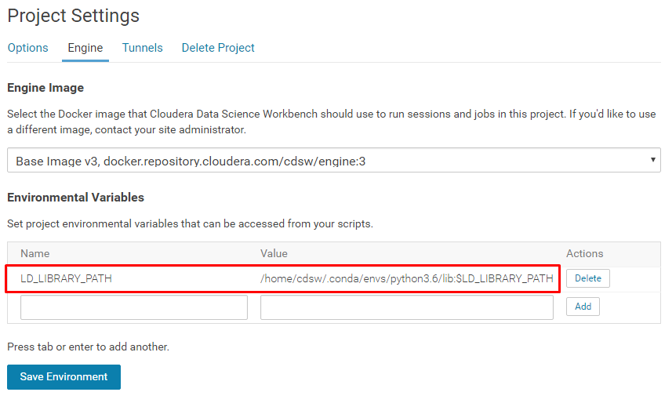

# MeCab installation for CDSW with Python 3 engine

1. Install mecab and mecab-python3
    1. Install using conda environment yaml
        - For old engine (v3 and lower): `!conda install -y --name python3.6 --file mecabenv.yml`
        - Otherwise: `!conda install -y --file mecabenv.yml`
    2. Or, install dependency manually   
        ```
        !conda install -y -c chezou mecab
        !pip3 install mecab-python3
        ```

    3. Add environment variable on CDSW Project page: `LD_LIBRARY_PATH` = `/home/cdsw/.conda/envs/python3.6/lib:$LD_LIBRARY_PATH`


